# 🏗️ SYSTRA BIM SaaS - Collaborative Hub & AI Assistant


## 🌟 Overview

SYSTRA BIM SaaS is a next-generation collaborative platform designed to revolutionize how BIM data is interacted with. By combining a powerful Vue.js dashboard with a Python backend and Google Gemini's advanced AI, this tool allows for intuitive, natural language interaction with complex IFC models.

Check out `docs/screenshots/` for a visual tour!

## 🏗️ Architecture

```mermaid
graph TD
    User([👷 User]) <-->|HTTP/WebSocket| Frontend[🖥️ Vue.js 3 Frontend]
    
    subgraph "Backend Ecosystem"
        Frontend <-->|REST API| Backend[⚙️ Python Flask Backend]
        Backend <-->|SQL| Database[(🗄️ SQLite Database)]
        Backend <-->|BIM Data| BIM[🏗️ IFC OpenShell Engine]
        
        subgraph "AI Core"
            Backend <-->|API Call| Router[🔀 Intent Router]
            Router <-->|GenAI| IA[🧠 Google Gemini AI]
        end
    end
```



## 🚀 Key Features

-   **🤖 AI Chatbot Assistant**: Ask natural language questions about your BIM models (e.g., "Combien de murs ?", "Surface totale ?").
-   **🏢 Intelligent BIM Analysis**: Automatic parsing and extraction of metadata from IFC files using IFC OpenShell.
-   **📊 SaaS Dashboard**: A modern, responsive interface for project management and team collaboration.
-   **🔄 Hybrid Mode**: Seamlessly switches between live AI responses and optimized offline demonstrations.

## 🛠️ Installation

### Prerequisites
-   Python 3.10+
-   Node.js 16+
-   Google Gemini API Key

### Quick Start

1.  **Clone the repository**
    ```bash
    git clone https://github.com/your-username/systra-bim-saas.git
    cd systra-bim-saas
    ```

2.  **Backend Setup**
    ```bash
    cd backend
    pip install -r requirements.txt
    # Create .env file with your GEMINI_API_KEY
    python app.py
    ```

3.  **Frontend Setup**
    ```bash
    cd frontend
    npm install
    npm run dev
    ```

## 📄 License
This project is protected. See the `LICENSE` file for details.
**Copyright (c) 2025 Dylan ONDO. All Rights Reserved.**
